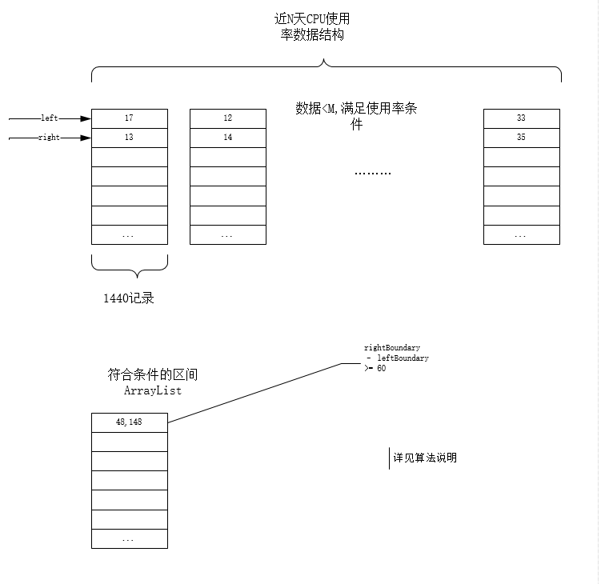
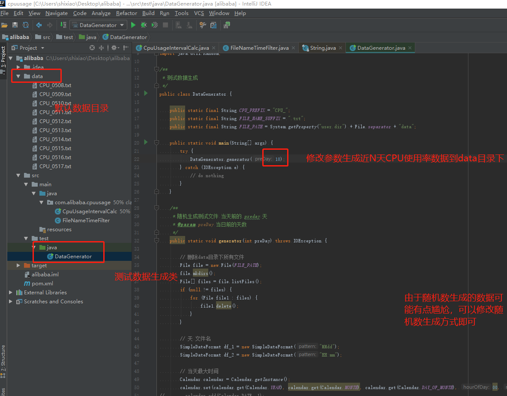
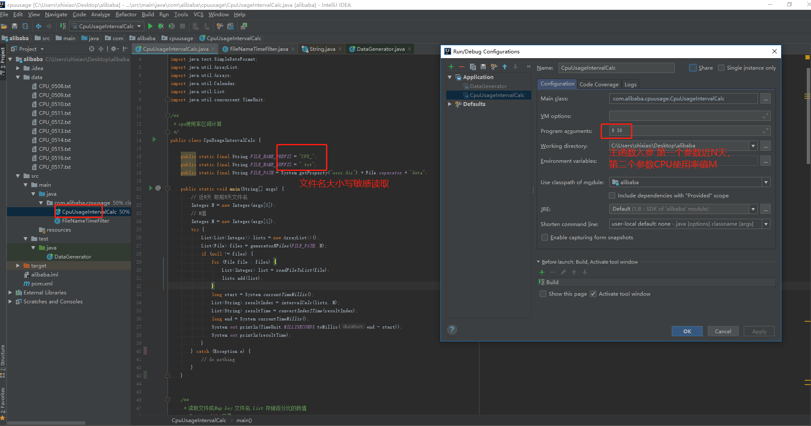

# aliyun

# 概述

本文档旨在指导开发思路，讲解如何使用已开发程序解决场景问题以及一些 _使用场景条件约束_。

## 场景

```
对CPU的使用率做了平均采样，每秒采集一个，格式如下：
00：00  10%
00：01  12%
00：02  11%
...
每天会产生一个文件，暂且这么定义：cpu_日期.txt，如：cpu_0402.txt
需求：最近N天，平均CPU使用率都是低于M%的，且大于等于1小时的相同时间段（注意相同时间段）
如：N=5，M=10，那么就应该从下面CPU_0328.txt,CPU_0329.txt,CPU_0330.txt,CPU_0401.txt,CPU_0402.txt求出平均CPU使用率都是低于10%的，且大于等于1小时的相同时间段。
比如00：00到04：00 CPU使用率几乎都是0（3.28，3.29，3.30，4.1，4.2这5天这个时间段的CPU使用率都<10%），那么这就是符合条件的时间段：00：00-04：00
```

## 前言

### 约束 _(根据题意cpu使用率记录应该有如下特性)_

+ 不支持跨年

+ CPU_0517.txt  / _CPU,txt大小写限制_

+ 每一天的CPU使用率记录应该是1440条

+ 每一天的CPU使用率是按照时间递增记录，即 00:00 ~ 23:59

+ 记录格式必须是00:00 2%，前半部分为时间加空格，后半部分为使用率百分比，且必须有数值

## 算法思想 _(类滑动窗口)_

+ 如图，读取近N天数据。数据结构有如下特性，已知每一天有1440条时间递增记录，显然我们知道第i条记录是当天第(i-1)分钟数据。那我们可以用arraylist<Integer>数据结构录入数据，截取每天每一行的百分比前数值存入arraylist<Integer>，这样根据下标我们能计算出时间。

+ 如图，近N天数据录入后，拥有一个List<List<Integer>>数据结构。设置滑动窗口左右标识初始值left=0,right=1。设置使用率满足小于M的区间左右标识初始值leftBoundary=0,rightBoundary=1。首先确认left的位置，读取list中的第一个文件的left位置值，小于M则继续读取list中下一个文件left位置值。如果有不满足情况退出循环，left++。如果读取到最后一个文件依然满足则left值确定，leftBoundary随即确定。其后确认right值位置，移动right值，小于M则继续读取list中下一个文件的right位置值。如果不满足情况则退出循环,确认此时的rightBoundary,left=++right,计算rightBoundary-leftBoundary>=60则满足区间条件保存，否则不保存。如果读取到最后一个文件依然满足right位置值小于，则判断是否是最后一个文件并且List已经越界。最后将计算出的list位置区间转化为时间区间。




+ 核心实现代码

```java
    /**
     * 类似滑动算法
     * 每日的CPU使用率符合条件区间计算
     * @param lists 每日的CPU市盈率信息
     * @return List<String> 00:01    01:01
     */
    private static List<String> intervalCalc(List<List<Integer>> lists, int m) {
        List<String> intervals = new ArrayList<>();
        int leftBoundary = 0;
        int rightBoundary = 1;

        int left = 0;
        int right = 1;
        while (left < 1380 && right < 1440) {
            for (int i = 0; i < lists.size(); i++) {
                if (lists.get(i).get(left) >= m) {
                    left++;
                    right++;
                    break;
                }
                if (lists.get(i).get(right) >= m) {
                    left = ++right;
                    right++;
                    if (rightBoundary - leftBoundary >= 60) {
                        intervals.add(leftBoundary + "," + rightBoundary);
                    }
                    break;
                }

                if (i == (lists.size() - 1)) {
                    leftBoundary = left;
                    rightBoundary = right;
                    right++;
                    if (right >= 1440) {
                        if (rightBoundary - leftBoundary >= 60) {
                            intervals.add(leftBoundary + "," + rightBoundary);
                        }
                    }
                }

            }
        }

        return intervals;
    }
```

## 程序使用步骤

+ 直接在git https://github.com/xiaoyao-jimmy/aliyun 地址下载源码导入JAVA IDEA，配置maven自动下载必要依赖。

+ 本工程包含一个测试数据生成器位于test文件夹下DataGenerator类，生成数据路径写死默认在data下面，文件名大写限定，需要配置。

+ 执行CpuUsageIntervalCalc主函数，修改主函数入参N,M值






## 性能测试

近 10 天 消耗 3ms

近 30 天 消耗 3ms

近 90 天 消耗 3ms

近 360 天 消耗 4ms

## 待提升

+ 当场景不同时，例如当多天数据录入超过内存上限的时候，磁盘块切换速度可能成为新的性能瓶颈。

